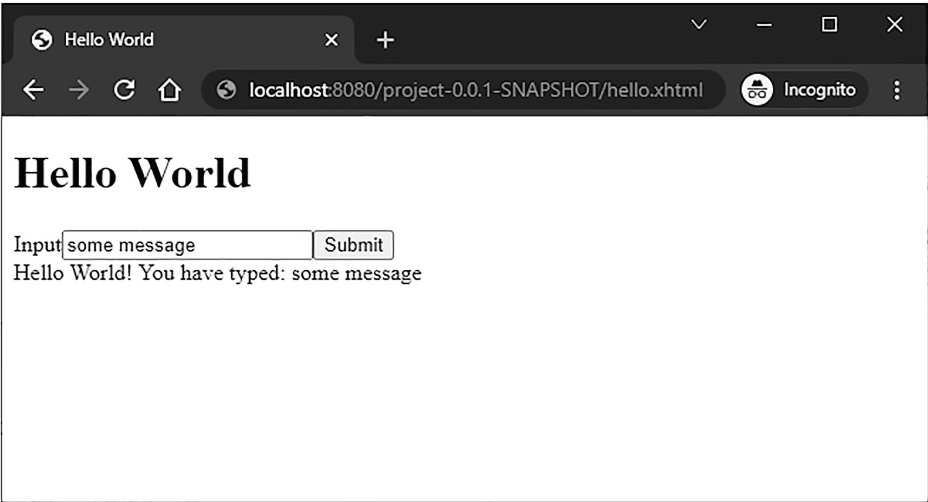

# Hello World

The *View* part of MVC.

It’s basically just an XHTML file that is by Jakarta Faces interpreted as a *Facelets file* or just “Facelet.” When the FacesServlet is invoked with a URL matching the path of this Facelets file, then Jakarta Faces will ultimately parse it and generate the HTML markup that is sent to the browser as a response to the request.

```html
<!DOCTYPE html>
<html lang="en"
    xmlns:f="jakarta.faces.core"
    xmlns:h="jakarta.faces.html"
>
    <h:head>
        <title>Hello World</title>
    </h:head>
    <h:body>
        <h1>Hello World</h1>
        <h:form>
            <h:outputLabel for="input" value="Input" />
            <h:inputText id="input" value="#{helloWorld.input}" />
            <h:commandButton value="Submit"
                action="#{helloWorld.submit}">
                <f:ajax execute="@form" render=":output" />
            </h:commandButton>
        </h:form>
        <h:outputText id="output" value="#{helloWorld.output}" />
    </h:body>
</html>
```

- **<h:head>: This generates the HTML <head> element. It gives Jakarta Faces the opportunity to automatically include any necessary JavaScript files, such as the one containing the necessary logic for <f:ajax>.**
- **<h:body>: This generates the HTML <body> element. You can also use a plain HTML <body> in this specific Facelet, but then it doesn’t give any other Jakarta Faces tag the opportunity to automatically include any necessary JavaScript in the end of the HTML <body>.**
- **<h:form>: This generates the HTML <form> element. Jakarta Faces will automatically include the so-called view state in a hidden input field within the form.**
- **<h:outputLabel>: This generates the HTML <label> element. You can also use a plain HTML <label> in this specific Facelet, but then you’d have to manually take care of figuring out the actual ID of the target input element.**
- **<h:inputText>: This generates the HTML <input type="text"> element. Jakarta Faces will automatically get and set the value in the bean property specified in the value attribute.**
- **<h:commandButton>: This generates the HTML <input type="submit">. Jakarta Faces will automatically invoke the bean method specified in the action attribute.**
- **<f:ajax>: This generates the necessary JavaScript code to enable Ajax behavior of the tag it is being nested in, in this case, the <h:commandButton>. You can also do as good without it, but then the form submit won’t be performed asynchronously. The execute attribute of @form indicates that the entire <h:form> where it is sitting in must be processed on submit, and the render attribute of :output indicates that the tag identified by id="output" must be automatically updated on completion of the Ajax submit.**
- **<h:outputText>: This generates the HTML <span> element. This is the one being updated on completion of the Ajax submit. It will merely print the bean property specified in the value attribute.**

